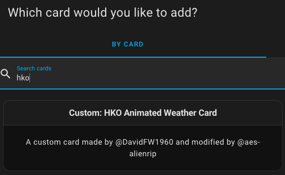

   
# Custom Animated Weather Card for Hong Kong Observatory

## IMPORTANT CHANGES

This is a weather card that works with **Hong Kong Observatory ONLY**

This card is a modification of a fork of [DavidFW1960/bom-weather-card](https://github.com/DavidFW1960/bom-weather-card)

This card provides MANY additional features as well as compatability with later versions of home assistant.
New features:
- Lit 3
- Only use Day time icons for forecast for future days (days 1-5)
- More icons
- Adds Locale customisation for number formats
- Added to card-picker in Lovelace
- Added option to show minimum or maximum first in forecast
- Added option to show 1 decimal place to temperatures, apparent temperature, todays max/min, and pressure
- Show rainfall as an intensity or absolute number
- Removed leading zeros if 12hr time
- Added Wind Gust
- Can use different icon sets
- Added extra (8th) row of slots
- Added slots (optional) for UV and fire danger ratings
- Added possibility of rainfall to forecast

The Weather Card provides current and forecast weather conditions using HA sensors. You configure the card by passing in sensor entities from the weather component.

The card is very customizable.  You can configure many aspects of it's look and feel as well as which specific content to show by passing in customization flags and defining optional sensors.  Content can also be rearranged if desired.

Hovering over a forecast day will display the daily weather summary in a tooltip popup if that option has been enabled.

# **Installation**
--------------------------
## Use HACS
Add this repo https://github.com/aes-alienrip/hko-weather-card

Install card from HACS as per other plugins. Note that you must add this card as a module to the resources section as per the instructions when you install the card.

#### Inside the base configuration file add the following entry:
~~~~
homeassistant:
  packages: !include_dir_named www/community/hko-weather-card/sensor/zh
~~~~

#### For English User:
~~~~
homeassistant:
  packages: !include_dir_named www/community/hko-weather-card/sensor/en
~~~~

#### File Structure
~~~~
└── ...
└── configuration.yaml
└── www
    └── community
        └── hko-weather-card
            └── sensor
		└── en
     		     └── input_select_en.yaml
     		     └── rest_en.yaml
     		     └── template_en.yaml
		└── zh
     		     └── input_select.yaml
     		     └── rest.yaml
     		     └── template.yaml
            └── weather_icons
		└── animated
		└── static
            └── hko-weather-card.js
            └── hko-weather-card.js.gz
~~~~

Installation is done. You must still configure the yaml manually.

# **Configuration**
--------------------------
1. Load new YAML configurations in Quick reload

2. Select your nearby Weather Station ([Temperature](https://www.hko.gov.hk/tc/wxinfo/ts/index.htm), [Humidity](https://www.hko.gov.hk/tc/wxinfo/ts/index_rh.htm), [Pressure](https://www.hko.gov.hk/tc/wxinfo/ts/index_pre.htm), [Wind](https://www.hko.gov.hk/tc/wxinfo/ts/index_wind.htm)) from Input Select helper 
   Developer Tools -> STATES -> Entity -> Search for "input_select.hko" 
 
3. Add the card definition: You can add this card from the card picker but need to configure the entities and flags in YAML. There are required / optional and flag entries.
This card has been added to the custom-card-picker in Lovelace

**An example configuration is in [lovelace.yaml](https://github.com/aes-alienrip/hko-weather-card/blob/master/lovelace.yaml) - this can be pasted into the manual card configuration in the GUI editor**
If you paste it in the raw editor or in a yaml file, take care with the indenting.

Required entries must be present 
in your configuration.  The card will not work at all if any of these lines are missing.
~~~~
type: custom:hko-weather-card
locale: zh
static_icons: false
tooltips: true
refresh_interval: 30
show_separator: true
time_format: locale
use_old_column_format: true
show_decimals: false
show_decimals_apparent: false
show_decimals_today: true
show_decimals_pressure: 1
entity_temperature: sensor.hko_temperature
entity_daytime_high: sensor.hko_temperature_max
entity_daytime_low: sensor.hko_temperature_min
entity_humidity: sensor.hko_humidity
entity_wind_bearing: sensor.hko_wind_bearing
entity_wind_speed: sensor.hko_wind_speed
entity_wind_gust: sensor.hko_wind_gust
entity_apparent_temp: sensor.hko_apparent_temp
entity_sun: sun.sun
entity_uv_alert_summary: sensor.hko_uvindex
entity_pressure: sensor.hko_pressure
entity_forecast_high_temp_1: sensor.hko_forecast_max_temp_0
entity_forecast_high_temp_2: sensor.hko_forecast_max_temp_1
entity_forecast_high_temp_3: sensor.hko_forecast_max_temp_2
entity_forecast_high_temp_4: sensor.hko_forecast_max_temp_3
entity_forecast_high_temp_5: sensor.hko_forecast_max_temp_4
entity_current_conditions: sensor.hko_forecast_icon
entity_forecast_icon_1: sensor.hko_forecast_icon_0
entity_forecast_icon_2: sensor.hko_forecast_icon_1
entity_forecast_icon_3: sensor.hko_forecast_icon_2
entity_forecast_icon_4: sensor.hko_forecast_icon_3
entity_forecast_icon_5: sensor.hko_forecast_icon_4
entity_forecast_low_temp_1: sensor.hko_forecast_min_temp_0
entity_forecast_low_temp_2: sensor.hko_forecast_min_temp_1
entity_forecast_low_temp_3: sensor.hko_forecast_min_temp_2
entity_forecast_low_temp_4: sensor.hko_forecast_min_temp_3
entity_forecast_low_temp_5: sensor.hko_forecast_min_temp_4
entity_daily_summary: sensor.hko_forecast_summary
entity_summary_1: sensor.hko_forecast_summary_0
entity_summary_2: sensor.hko_forecast_summary_1
entity_summary_3: sensor.hko_forecast_summary_2
entity_summary_4: sensor.hko_forecast_summary_3
entity_summary_5: sensor.hko_forecast_summary_4
entity_pop_1: sensor.hko_forecast_psr_0
entity_pop_2: sensor.hko_forecast_psr_1
entity_pop_3: sensor.hko_forecast_psr_2
entity_pop_4: sensor.hko_forecast_psr_3
entity_pop_5: sensor.hko_forecast_psr_4
~~~~

**Flags**
--------------------------

#### Flags are used to control the look and feel of the card (See below for details)

~~~~
locale: en
static_icons: false
tooltip_bg_color: 'rgb( 75,155,239)'
tooltip_border_color: orange
tooltip_border_width: 3
tooltip_caret_size: 10
tooltip_fg_color: '#fff'
tooltip_left_offset: -12
tooltip_width: 100
tooltips: true
old_daily_format: false
time_format: 24
show_beaufort: true
show_decimals: false
~~~~

--------------------------
| Flag                     | Values                             | Usage                                                                       |
|--------------------------|------------------------------------|-----------------------------------------------------------------------------|
| locale                   | **en** / zh                        | Sets locale display of day names and time formats                           |
| static_icons             | true / **false**                   | Switches between static (true) and animated (false) icons                   |
| tooltips                 | true / **false**                   | Enables tooltips that show daily forecast summary                           |
| tooltip_width            | **110**                            | Sets the width of the tooltip in px                                         |
| tooltip_bg_color         | **rgb( 75,155,239)**               | Sets the background color of the tooltip (rgb / # / color)                  |
| tooltip_fg_color         | **#fff**                           | Sets the foreground color of the tooltip (rgb / # / color)                  |
| tooltip_border_color     | **rgb(255,161,0)**                 | Sets the color of the tooltip border including the caret (rgb / # / color)  |
| tooltip_border_width     | **1**                              | Sets the width of the tooltip border in px                                  |
| tooltip_caret_size       | **5**                              | Sets the size of the caret (the little arrow pointing down) in px           |
| tooltip_left_offset      | **-12**                            | Sets the offset of the left edge of the tooltip. In negative (-)x           |
| refresh_interval         | **30** / Integer value             | Sets the nuber of seconds between card value refreshes                      |
| old_daily_format         | true / **false**                   | Sets the format of the daily high & low temps to be stacked (old format)    |
| show_beaufort            | true / **false**                   | Shows Beaufort Scale wind information                                       |
| show_separator           | true / **false**                   | Shows separator between current conditions columns and current temp / Icon  |
| tempformat               | highlow / **noentry**              | Any setting for this flag will trigger the option to show max/min in daily  |
| time_format              | **locale** / 12 / 24               | Sets the format sunset and sunrise times. locale format is the default.     |
| temp_top_margin          | **9px** / px or em value           | Sets the top margin of the Temperature.                                     |
| temp_font_weight         | **300** / numeric value            | Sets the font weight of the Temperature.                                    |
| temp_font_size           | **4em** / em value                 | Sets the font size of the Temperature.                                      |
| temp_right_pos           | **0.85em** / px or em value        | Sets the right position of the Temperature.                                 |
| temp_uom_top_margin      | **-3px** / px or em value         | Sets the top margin of the Temperature Unit of Meaure.                       |
| temp_uom_right_margin    | **4px** / px or em value           | Sets the right margin of the Temperature Unit of Measure.                   |
| apparent_top_margin      | **45px** / px or em value          | Sets the top margin of the apparent (feels Like) temperature                |
| apparent_right_pos       | **1em** / px or em value           | Sets the right position of the apparent (feels Like) temperature            |
| apparent_right_margin    | **1em** / px or em value           | Sets the right margin of the apparent (feels Like) temperature              |
| current_text_top_margin  | **0.8em** / px or em value         | Sets the top margin of the current temperature text                         |
| current_text_left_pos    | **0px** / px or em value           | Sets the left position of the current temperature text                      |
| current_text_font_size   | **2em** / em value                 | Sets the font size of the current temperature text                          |
| current_text_alignment   | **center** / left, right or center | Sets the alignment of current text                                          |
| current_text_width       | **100%** / px, em or %             | Sets the width of current text                                              |
| current_data_top_margin  | **10em** / px or em value          | Sets the top margin of the current data blocks                              |
| large_icon_top_margin    | **-3em** / px or em value          | Sets the top margin of the current conditions icon                          |
| large_icon_left_position | **0px** / px or em value           | Sets the left position of the current conditions icon                       |
| separator_top_margin     | **6em** / px or em value           | Sets the top margin of the separator line                                   |
| summary_top_padding      | **1em** / px or em                 | Sets the gap between the forecast and summary text                          |
| summary_font_size        | **1em** / px or em                 | Sets the font size for the summary text                                     |
| slot_l1                  | **sun_next**                       | Sets the value used in current conditions slot l1 : See slots for more info |
| slot_l2                  | **maxmin_since_midnight**          | Sets the value used in current conditions slot l2 : See slots for more info |
| slot_l3                  | **wind**                           | Sets the value used in current conditions slot l3 : See slots for more info |
| slot_l4                  | **pressure**                       | Sets the value used in current conditions slot l4 : See slots for more info |
| slot_l5                  | **rainfall_in_past_hour**          | Sets the value used in current conditions slot l5 : See slots for more info |
| slot_l6                  |                                    | Sets the value used in current conditions slot l6 : See slots for more info |
| slot_l7                  |                                    | Sets the value used in current conditions slot l7 : See slots for more info |
| slot_l8                  |                                    | Sets the value used in current conditions slot l8 : See slots for more info |
| slot_r1                  | **sun_following**                  | Sets the value used in current conditions slot r1 : See slots for more info |
| slot_r2                  | **humidity**                       | Sets the value used in current conditions slot r2 : See slots for more info |
| slot_r3                  | **uv_summary**                     | Sets the value used in current conditions slot r3 : See slots for more info |
| slot_r4                  | **fire_summary**                   | Sets the value used in current conditions slot r4 : See slots for more info |
| slot_r5                  | **pop**                            | Sets the value used in current conditions slot r5 : See slots for more info |
| slot_r6                  |                                    | Sets the value used in current conditions slot r6 : See slots for more info |
| slot_r7                  |                                    | Sets the value used in current conditions slot r7 : See slots for more info |
| slot_r8                  |                                    | Sets the value used in current conditions slot r8 : See slots for more info |
| use_old_column_format    | **false** / true                   | Moves the right column to the right edge (not recommended)                  |
| show_decimals            | **false** / true                   | Sets card to render current temperature to 1 decimal place                  | 
| show_decimals_apparent   | **false** / true                   | Sets card to render apparent temperature to 1 decimal place                 |
| show_decimals_today      | **false** / true                   | Sets card to render todays min and max temperatures to 1 decimal place      |
| show_decimals_pressure   | **false** / true                   | Sets card to render pressure to 1 decimal place                             |
| custom1_icon             | **mdi:help-box** / mdi icon        | Sets the icon to use for slot custom1                                       |
| custom1_value            | **unknown** / sensor               | Sets the sensor to use for the value of slot custom1                        |
| custom1_units            | **""** / string                    | Sets the string to use for the units of slot custom1                        |
| custom2_icon             | **mdi:help-box** / mdi icon        | Sets the icon to use for slot custom2                                       |
| custom2_value            | **unknown** / sensor               | Sets the sensor to use for the value of slot custom2                        |
| custom2_units            | **""** / string                    | Sets the string to use for the units of slot custom2                        |
| custom3_icon             | **mdi:help-box** / mdi icon        | Sets the icon to use for slot custom3                                       |
| custom3_value            | **unknown** / sensor               | Sets the sensor to use for the value of slot custom3                        |
| custom3_units            | **""** / string                    | Sets the string to use for the units of slot custom3                        |
| custom4_icon             | **mdi:help-box** / mdi icon        | Sets the icon to use for slot custom4                                       |
| custom4_value            | **unknown** / sensor               | Sets the sensor to use for the value of slot custom4                        |
| custom4_units            | **""** / string                    | Sets the string to use for the units of slot custom4                        |
| custom5_icon             | **mdi:help-box** / mdi icon        | Sets the icon to use for slot custom5                                       |
| custom5_value            | **unknown** / sensor               | Sets the sensor to use for the value of slot custom5                        |
| custom5_units            | **""** / string                    | Sets the string to use for the units of slot custom5                        |
| custom6_icon             | **mdi:help-box** / mdi icon        | Sets the icon to use for slot custom6                                       |
| custom6_value            | **unknown** / sensor               | Sets the sensor to use for the value of slot custom6                        |
| custom6_units            | **""** / string                    | Sets the string to use for the units of slot custom6                        |
| custom7_icon             | **mdi:help-box** / mdi icon        | Sets the icon to use for slot custom7                                       |
| custom7_value            | **unknown** / sensor               | Sets the sensor to use for the value of slot custom7                        |
| custom7_units            | **""** / string                    | Sets the string to use for the units of slot custom7                        |
| custom8_icon             | **mdi:help-box** / mdi icon        | Sets the icon to use for slot custom8                                       |
| custom8_value            | **unknown** / sensor               | Sets the sensor to use for the value of slot custom8                        |
| custom8_units            | **""** / string                    | Sets the string to use for the units of slot custom8                        |

**Slots**
--------------------------
The current condition columns are specified by 'slots'.  There are 8 left column slots (designated l1 - l8) and 8 right column
slots (designated r1 - r8).  There are currently 16 possible values that can be assigned to a slot.  These are:
- daytime_high
- daytime_low
- maxmin_since_midnight (max and min temperature since midnight)
- wind
- visibility
- sun_next (the next sun event ... sunset or sunrise)
- sun_following (The following sun event ... if sun_next is a sunset then this will be the following sunrise and vice versa)
- pop (probability of precipitation) Shows % possible rainfall today and the actual recorded rainfall
- popforecast Shows % possible rainfall today and forecast rainfall
- humidity
- pressure
- uv_summary
- fire_summary
- possible_today (possible rainfall today)
- possible_tomorrow (possible rainfall tomorrow)
- custom1 (populates using config fields custom1_icon, custom1_value and custom1_units)
- custom2 (populates using config fields custom2_icon, custom2_value and custom2_units)
- custom3 (populates using config fields custom3_icon, custom3_value and custom3_units)
- custom4 (populates using config fields custom4_icon, custom4_value and custom4_units)
- custom5 (populates using config fields custom5_icon, custom5_value and custom5_units)
- custom6 (populates using config fields custom6_icon, custom6_value and custom6_units)
- custom7 (populates using config fields custom7_icon, custom7_value and custom7_units)
- custom8 (populates using config fields custom8_icon, custom8_value and custom8_units)
- empty (empty slot... the slot below does not rise to fill the space)
- remove (same as empty but the slot below rises to take the place of the slot)

If configuring with Slots please ensure to fill all available positions, the slots that you do not need can be filled with "remove" to ensure that they remain blank.
